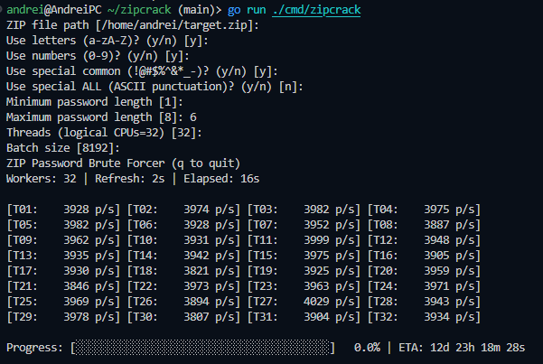

# ZipCrack

ZipCrack is a terminal-based ZIP password brute forcer built in Go. It loads an encrypted ZIP into memory, generates random password candidates from a user-selected character set, and tries them concurrently while rendering a live TUI with per-thread throughput, total attempts, progress, and ETA.

Screenshot

Key capabilities
- Interactive CLI prompts for input file, character sets, min/max lengths, threads, and batch size. See [main.promptString()](cmd/zipcrack/main.go:22), [main.promptYesNo()](cmd/zipcrack/main.go:32), [main.promptInt()](cmd/zipcrack/main.go:46).
- Concurrent cracking pipeline coordinated by [cracker.NewRunner()](internal/cracker/runner.go:49) with worker stats and result channels.
- TUI built with Bubble Tea via [tui.NewModel()](internal/tui/model.go:74) showing per-thread p/s, totals, progress bar, and ETA.
- Per-worker ZIP verification using [cracker.ZipWorker.Try()](internal/cracker/zipcheck.go:80) on the smallest encrypted file in the archive for speed.

Requirements
- Go (1.20+ recommended).
- Linux/macOS/WSL. Tested on WSL.

Install

Clone this repository, then fetch dependencies:

`go mod download`

Build

Build the CLI binary:

`go build -o zipcrack ./cmd/zipcrack`

Or run without building:

`go run ./cmd/zipcrack`

Usage

1. Prepare an encrypted ZIP file you want to test (the app only targets encrypted entries; unencrypted files are ignored).
2. Launch the program:

`./zipcrack`

3. Follow the prompts:
- ZIP file path: Path to the target ZIP (default: /home/andrei/target.zip).
- Character sets: Toggle letters, numbers, common specials, or all ASCII punctuation.
- Minimum password length: Non-negative integer (default: 1).
- Maximum password length: Non-negative integer, adjusted to be >= min (default: 8).
- Threads: Number of workers, typically CPU cores. Default is your logical CPU count.
- Batch size: How many random candidates to generate per batch per tick. Larger batches reduce overhead but increase latency to stop.

Controls
- q or Ctrl+C: Quit the TUI.

What you will see
- Per-thread throughput lines like [T01: 123456 p/s], grouped in rows.
- Total throughput and attempts.
- Progress bar and ETA when alphabet size and length bounds are known. This is an estimate over the random search space sum_{k=min..max}(alphabet^k).
- If a password is found, the program exits the TUI and prints: Password found: <value>

Notes on approach
- Random search: Candidates are sampled uniformly from the selected alphabet and length bounds by [cracker.generateBatch()](internal/cracker/generator.go:10). This is not exhaustive enumeration and may revisit candidates; it trades determinism for simplicity and parallel scalability.
- Target selection: The checker chooses the smallest encrypted file in the archive once; every worker builds its own reader to avoid shared state. See [cracker.NewZipChecker()](internal/cracker/zipcheck.go:26) and [cracker.ZipChecker.NewWorker()](internal/cracker/zipcheck.go:66).
- Throughput accounting: Worker attempt counters are aggregated periodically and published as [cracker.Stats](internal/cracker/runner.go:11) over a channel sampled by the TUI.

Performance tips
- Increase Threads up to the number of logical CPUs. Going beyond may hurt throughput due to contention.
- Increase Batch size to reduce scheduling overhead; very large batches can make stopping slower.
- Narrow Min/Max length and alphabet when you can.
- Use Special Common instead of Special ALL unless you need the full ASCII punctuation range; smaller alphabets reduce the search space dramatically.

Safety and legality
- Only use this tool on archives you own or are authorized to test. Unauthorized access attempts may be illegal.

Project structure
- [cmd/zipcrack/main.go](cmd/zipcrack/main.go) — interactive entry point and TUI wiring, see [main.main()](cmd/zipcrack/main.go:63).
- [internal/tui/model.go](internal/tui/model.go) — Bubble Tea model, rendering, and keyboard handling via [tui.model.Update()](internal/tui/model.go:108) and [tui.model.View()](internal/tui/model.go:168).
- [internal/cracker/runner.go](internal/cracker/runner.go) — orchestrates generator, workers, stats, and result publication via [cracker.Runner.Start()](internal/cracker/runner.go:82).
- [internal/cracker/zipcheck.go](internal/cracker/zipcheck.go) — AES/ZipCrypto password checks with yeka/zip.
- [internal/cracker/generator.go](internal/cracker/generator.go) — random candidate generation.
- [internal/charset/charset.go](internal/charset/charset.go) — character sets and utilities.

FAQ

Q: Does it try every possible password in order?
A: No. It samples randomly within your constraints. It can find short or simple passwords quickly, but exhaustive guarantees are not provided.

Q: Can I point it at huge ZIPs?
A: It chooses the smallest encrypted entry to test against to minimize per-attempt cost, so large archives are fine as long as at least one encrypted file exists.

Q: Why progress/ETA sometimes missing?
A: If parameters are insufficient or throughput is zero, ETA/progress may not render.

MIT License
